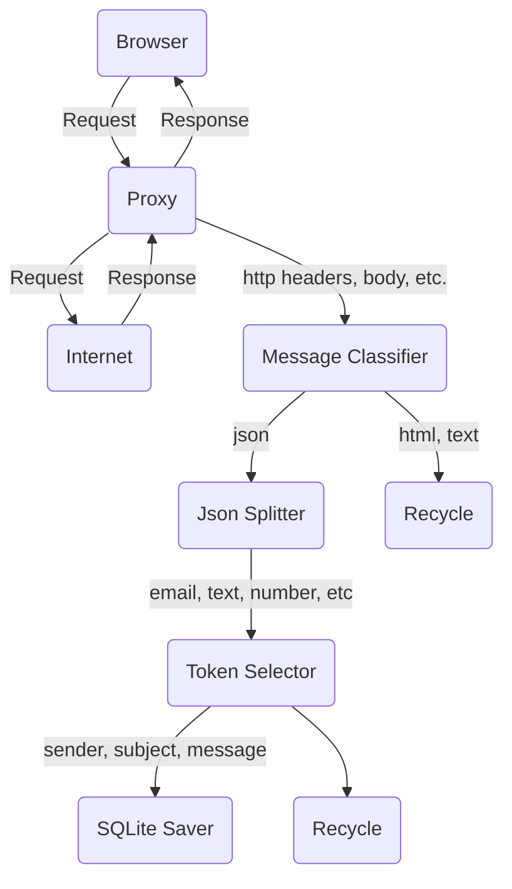

# Animals App

Sample application to display a list of animals.

## Patterns

Common patterns and ideas used to architect this codebase

- Presentation Components and Container Components
- Redux State Management (using NgRx), with effects and services decoupled from other components,like, for example, API calls, clock timers, local storage, etc.
- Unit Tests per Layer
- Feature Component to possible meet a future Front End Microservice Architecture
- Lazy load components in Angular for performance reasons
- and others, like View Model for queries

## Technologies

- RxJs: to control the data flow with simple and high-order observables
- NgRx: to keep a consistent internal data state
- Angular Material: to have a framework of presentation components
- Jasmine: the unit test framework

## Getting Started

Make sure you have Angular [installed](https://angular.io/guide/setup-local)

After that, you can run the below commands from the directory you unzipped your files

```
npm install
ng serve
```

Open the URL http://localhost:4200

## Unit Tests

To run the unit tests

```
ng test
```

### Possible Improvements

- Use Jest to unit tests instead of Jasmine, maybe to use snapshot tests, could accelerate the unit tests coding
- Update this feature to become a functional Angular Material application
- Use different policies for assets and configuration values to maybe meet performance and CI/CD requirements
- Code a e2e test solution by BDD ideas, maybe with tools like Cypress, Gherkin language and Cucumber, etc.
- Dockerize this application in order to have consistent development and production environments
